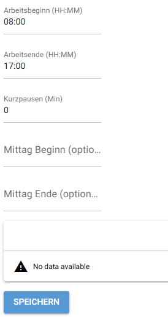

# 📊🔢 WTCalculator – Working Time Calculator (Browser App)

> 
## 📝 Application Requirements

### Problem
> Für kleinere Firmen ist das Erfassen der Arbeitszeiten ein essentieller Prozess.  
Kommerzielle Lösungen wie SAP sind jedoch teuer. Mit unserer App bieten wir eine **einfache und kostengünstige Alternative** zur Arbeitszeiterfassung.

### Scenario
In unserer Python Appikation sollen Arbeitszeiten erfasst und ausgewertet werden können. Ein User kann Arbeitsbeginn und Arbeitsende als Uhrzeiten erfassen und die Pausen als Stunden/Minuten Input. Ausgewertet wird die Brutto und die Netto Arbeitszeit. 
Die ausgerechneten Zeiten werden mit bestimmten Rules, die festgelegt sind, abgeglichen. Beispiele sind hier: Maximalarbeitszeiten (Max Überstundenanzahl), Einhaltung der Mittags-Pausenzeit (Keine Pausen unter 30 Minuten).
Der Vorgesetzte kann die Mitarbeiter-Daten pflegen (wie bspw. das Alter), damit die gültigen Regeln (z.B. Jugendschutzgesetz) automatisch angewendet werden.

## 📖 User Stories
1. Als User möchte ich meine Arbeitszeit exakt eingeben (hh:mm) 
2. Ich möchte meine Tages-, Wochen- und Monatsarbeitszeit auf dem Blatt sehen (Eingabe einzelner Tage und Auswertung der Woche oder des Monats mit bestehenden Daten) 
3. Als User möchte ich eine Fehlermeldung in Form eines Kommentars sehen, wenn ich die gesetzliche mindest Mittagszeit unterschreite
4. Ich möchte als User Mittagspausen eintragen können.
5. Ich möchte als User eine Warnmeldung als Kommentar bekommen, wenn meine maximale Wochenarbeitszeit 45h überschritten ist 
6. Ich möchte mich als User bei der Verwendung des Tools mittels ID und Nachname authentifizieren 
7. Als Vorgesetzter will ich Ende des Monats oder der Woche einen Repport erstellen können über die Arbeitszeiten meiner Mitarbeiter 
8. Als minderjähriger Mitarbeiter darf ich nicht über 9h arbeiten und keine Nacht- oder Wochenendarbeit machen, damit die Jugendarbeitsschutzgesetze eingehalten werden. Ausnahmen können begründet vorkommen oder es können nachträglich die Zeiten korrigiert werden

## 🧩 Use Cases
- Authentifizieren mittels ID und Nachnahmen
- Arbeitszeiten und Mittagspausen eingeben  
- Eingaben validieren  
- Zeitrapport auf Wochen- und Monatsbasis ausgeben  
- Kommentare bei Regelverletzungen anzeigen
- Unterschiedliche Menüs für Mitarbeiter und Vorgesetzte


### Main Use Cases
- Zeit erfassen (Mitarbeiter)  
- Zeiterfassung überprüfen (Vorgesetzter)  

-> im Diagramm wird nur die UC-Gruppe der Zeiterfassung beschrieben:


### Actors
- Mitarbeiter  
- Vorgesetzter

---

### Wireframes / Mockups

#### Mockup: Login


#### Mockup: CSV Import


#### Mockup: Ansicht Vorgesetzter


---

## 🏛️ Architecture


---
### Layers
---
#### UI: NiceGUI
Die Benutzeroberfläche wird mit NiceGUI umgesetzt. Sie dient zur Eingabe und Anzeige von Benutzerdaten, Zeiteinträgen und Auswertungen.

#### Application logic: Services und TimeCalculator
Die Geschäftslogik liegt in den Service-Klassen. AuthService verwaltet die Anmeldung, UserService die Benutzer, TimeEntryService die Zeiteinträge und ReportService die Monatsauswertungen. Der TimeCalculator berechnet die Nettoarbeitszeit und erzeugt Kommentare.

#### Persistence: SQLite, ORM und Datenmodelle
Die Daten werden über ORM-Modelle gespeichert. User und TimeEntry bilden die zentralen Datenobjekte. Ein Benutzer kann mehrere Zeiteinträge besitzen, während jeder Zeiteintrag genau einem Benutzer gehört. 

---
### Design Decisions
---

#### Klare Trennung zwischen Daten und Logik
User, TimeEntry, MonthlyReport und WorkTimeResult enthalten Daten. Die Services übernehmen die Verarbeitung und greifen auf diese Klassen zu.

#### Service-orientierte Struktur
Jede Service-Klasse hat eine klar abgegrenzte Aufgabe: Authentifizierung, Benutzerverwaltung, Zeiterfassung oder Reporting.

#### Berechnungslogik ausgelagert
Die Berechnung der Arbeitszeit ist im TimeCalculator gekapselt. Dadurch bleibt TimeEntryService übersichtlich und delegiert die Berechnung an eine eigene Klasse.

---
### Patterns Used
---

#### Service Pattern
AuthService, UserService, TimeEntryService und ReportService kapseln die Anwendungslogik.

#### Repository / DAO Ansatz über Session
Alle Services verwenden eine _session, um Daten zu lesen, zu speichern oder zu verwalten. Dadurch ist der Datenzugriff von der restlichen Logik getrennt.

#### Model Relationship
User und TimeEntry stehen in einer 1:n-Beziehung. Ein Benutzer kann viele Zeiteinträge haben, ein Zeiteintrag gehört zu genau einem Benutzer.

#### DTO / Result Objects
MonthlyReport und WorkTimeResult dienen als einfache Rückgabeobjekte für Reports und Berechnungsergebnisse.

---

## 🗄️ Database and ORM


The application uses **SQLAlchemy** to map domain objects to a SQLite database.

### Entities
- `Mitarbeiter`
- `Vorgesetzte`
- `Arbeitszeiterfassung`

### Relationships
- Ein `Mitarbeiter` → mehrere `Arbeitszeiterfassung`
- Jede `Arbeitszeiterfassung` wird geprüft durch ein `Vorgesetzte`

---

## ✅ Project Requirements

---

> 🚧 Requirements act as a contract: implement and demonstrate each point below.

Each app must meet the following criteria in order to be accepted (see also the official project guidelines PDF on Moodle):

1. Using NiceGUI for building an interactive web app
2. Data validation in the app
3. Using an ORM for database management

---

### 1. Browser-based App (NiceGUI)

> 🚧 In this section, document how your project fulfills each criterion.

Die Applikation interagiert mit dem User via browser. Users können:

- Sich einloggen
- Ihre Arbeitszeit erfassen
- Kommentare erhalten, wenn die Arbeitszeit der Validierung widerspricht
- Arbeitszeitrapporte generieren (bspw. für Vorgesetzte)

**Architecture note (per SS26 guidelines):** the browser is a thin client; UI state + business logic live on the server-side NiceGUI app.

---

### 2. Daten Überprüfung

- **user validation:** Der user gibt seine ID und Nachnamen ein. Das Check-In prüft, ob beide Eingaben gemäss jscon-Dictionary (Mitarbeiterdaten) übereinstimmen. ID muss aus Zahlen bestehen, Name aus Buchstaben

- **age validation:** Ist der User minderjährig, erhält er Kommentare bei Tagesarbeitszeit über 9h, bei Nachtarbeit (22:00-06:00) und bei Wochenendarbeit

- **time input validation:** Die Arbeitszeit darf nur im Format hh:mm erfasst werden

- **break validation:** Der user gibt seine Mittagszeiten ein. Ohne Mittagspause wird das gesetzliche Minimum von 30min abgezogen, ausser es wird Nachtarbeit erkannt

- **work time validation:** Die vorgesehene Arbeitszeit ist 42h. Alles darüber gilt als Überstunden. Nicht vorgesehen aber nicht verboten sind Überstunden ab 45h

- **input validation:** Diverse Eingaben im Check-In und im Menü werden auf das Format geprüft, bei Bedarf korrigiert (Gross-/Kleinschreibung) oder bei falscher Eingabe kommentiert und zur neuen Eingabe aufgefordert

---

### 3. Database Management

- Wir nutzen SQLAlchemy als ORM Framework
- In jedem unserer Services werden Python-Objekte erstellt und diese in Datenbank-Sessions übergeben 
- Auslesen der Daten wird mit ORM-Syntax umgesetzt und die Daten werden über Attribute der Klassen gefiltert
- Mit xy.approved generieren wir in unseren Services automatische Updates über die Attribute der Objekte

---

## ⚙️ Implementation

### Technology
- Python 3.x
- Umgebung: GitHub Codespaces
- Keine externen libraries

### Libraries Used

### Externe Bibliotheken (Third-Party)

* **[SQLAlchemy](https://www.sqlalchemy.org/):** Wir nutzen es als Object-Relational Mapper (ORM), um objektorientiert mit der SQLite-Datenbank zu interagieren.
* **[NiceGUI](https://nicegui.io/):** Unser Frontend-Framework. Es ermöglicht uns, die gesamte grafische Web-Benutzeroberfläche (Dashboards, Tabellen, Dialoge) direkt und nahtlos in Python zu entwickeln.

### Python Standardbibliothek (Built-ins)

* **`datetime` / `time`:** Für die komplexe Logik der Arbeitszeitberechnung, Pausenabzüge und Nachtschichterkennung.
* **`dataclasses`:** Für schlanke und unveränderliche Datenobjekte (z. B. `WorkTimeResult`, `MonthlyReport`) zur sicheren Datenübergabe zwischen den Schichten.
* **`csv` / `io`:** Für den reibungslosen Import und die Verarbeitung der alten (Legacy) Zeiterfassungsdaten.
* **`json`:** Für das automatische Seeding (initiale Befüllung) der Datenbank mit Benutzerdaten.
* **`pathlib`:** Für moderne, sichere und betriebssystemunabhängige Pfad- und Dateioperationen.

### 📂 Repository Struktur

Das Projekt folgt einer sauberen MVC-Architektur (Model-View-Controller) mit einer dedizierten Service- und Domain-Schicht.

```text
WORKING-TIME-CALCULATOR/
├── .devcontainer/         # Konfiguration für Entwicklungscontainer (z.B. GitHub Codespaces)
├── .github/               # GitHub-spezifische Dateien (z.B. CI/CD Workflows)
├── .vscode/               # Lokale Editor-Einstellungen für VS Code
├── data/                  # Speicherort für lokale Daten (z.B. die SQLite-Datenbank)
├── scripts/               # Hilfs- und Setup-Skripte
├── wtcalculator/          # 📦 Hauptpaket der Anwendung
│   ├── docs/ui-images/    # Bilder für Dokumentation, Mockups und UML-Diagramme
│   ├── domain/            # Kern-Geschäftslogik
│   │   └── time_calculator.py # Reine Berechnungslogik (z.B. Nettoarbeitszeit, Pausenabzug)
│   ├── services/          # Service-Schicht (Datenbank-Interaktion & Validierung)
│   │   ├── auth_service.py
│   │   ├── report_service.py
│   │   ├── time_entry_service.py
│   │   └── user_service.py
│   ├── app_controler.py   # Zentraler Controller (verbindet UI mit Services)
│   ├── db.py              # Datenbank-Verbindung und Session-Management (SQLAlchemy)
│   ├── models.py          # SQLAlchemy ORM-Modelle (Tabellenstrukturen für User & Zeiten)
│   ├── security.py        # Sicherheitsfunktionen (Passwort-Hashing & Policies)
│   └── webapp.py          # Präsentationsschicht (NiceGUI Views & UI-Klassen)
├── .gitignore             # Ignorierte Dateien für die Versionskontrolle
├── main2.py               # Bootstrapper/Einstiegspunkt der Anwendung
├── README.md              # Hauptdokumentation des Projekts
└── requirements.txt       # Python-Abhängigkeiten und Bibliotheken
```
### How to Run *in progress*

### 1. Project Setup
- Python 3.13 (or the course version) is required
- Create and activate a virtual environment:
   - **macOS/Linux:**
      ```bash
      python3 -m venv .venv
      source .venv/bin/activate
      ```
   - **Windows:**
      ```bash
      python -m venv .venv
      .venv\Scripts\Activate
      ```
- Install dependencies:
   ```bash
   pip install -r requirements.txt
   ```

### 2. Configuration
- E.g., setup of parameters or environment variables

### 3. Launch
- Start the NiceGUI app (example):
   ```bash
   py -m pizza_app
   ```
- Open the URL printed in the console.

### 4. Usage

Zeiterfassung als Mitarbeiter:
1. Öffne **Visual Studio Code**
2. Öffne **Terminal**
3. Starte Programm:	source .venv/bin/activate python main.py
4. Authentifizieren als Benutzer
	#### Benutzerübersicht
 | ID  | Nachname      | Rolle       |
 | --- | ------------- | ----------- |
 | 001 | Müller        | Mitarbeiter |
 | 002 | Suter         | Mitarbeiter |
 | 003 | Hübner		(u18) | Mitarbeiter |
 | 004 | Ackermann     | Vorgesetzer |
5. Erfasse Arbeitszeit, lade eine .csv-Datei hoch oder schau dir deinen Rapport an

Einstieg als Vorgesetzter (nach Schritt 4):
1. Mutiere Mitarbeiter-Daten
2. Prüfe Arbeitszeit der Mitarbeitenden

> 🚧 Add UI screenshots of the main screens (or a short video link):




---

## 🧪 Testing - *in progress*

> 🚧 Explain what you test and how to run tests.

**Test mix:**
- Overall 12 tests
- 6 Unit tests: e.g. subtotal calculation, discount application above CHF 50, no discount at or below threshold, total calculation
- 3 DB tests: e.g. menu query returns seeded pizzas, saving an order persists order + order items, empty DB / empty transactions behavior
- 3 Integration tests: e.g. checkout with one pizza creates order and invoice, checkout with multiple pizzas applies discount correctly

**Template for writing test cases**
1. Test case ID – unique identifier (e.g., TC_001)
2. Test case title/description – What is the test about?
3. Preconditions: Requirements before executing the test
4. Test steps: Actions to perform
5. Test data/input
6. Expected result
7. Actual result
8. Status – pass or fail
9. Comments – Additional notes or defect found

---

## 👥 Team & Contributions

| Name               | Contribution                                                                                                                                                                                                                              |
| ------------------ | ----------------------------------------------------------------------------------------------------------------------------------------------------------------------------------------------------------------------------------------- |
| Flavio Waser       | NiceGUI UI, Anpassung des Hauptcodes auf objektorientierte Programmierung, Mockups, CSV-Import                                                                 |
| Kristina Schaffner | Readme-File und diverese Grafiken, Passwort-Design optimieren, Umbau des ersten Entwurfs nach MVC                                                                        |
| Mika Leuenberger   | Ausführung für Mac optimieren, Programmstart, diverse Validierungen überprüfen und aktualisieren |


## 🤝 Contributing

> 🚧 This is a template repository for student projects.  
> 🚧 Do not change this section in your final submission.

- Use this repository as a starting point by importing it into your own GitHub account.  
- Work only within your own copy — do not push to the original template.  
- Commit regularly to track your progress.

## 📝 License

This project is provided for **educational use only** as part of the Programming Foundations module.  
[MIT License](LICENSE)
