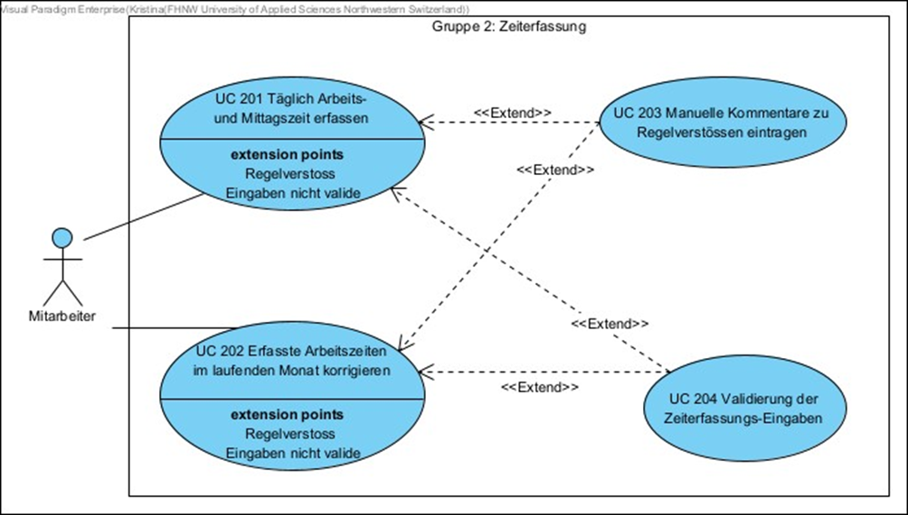
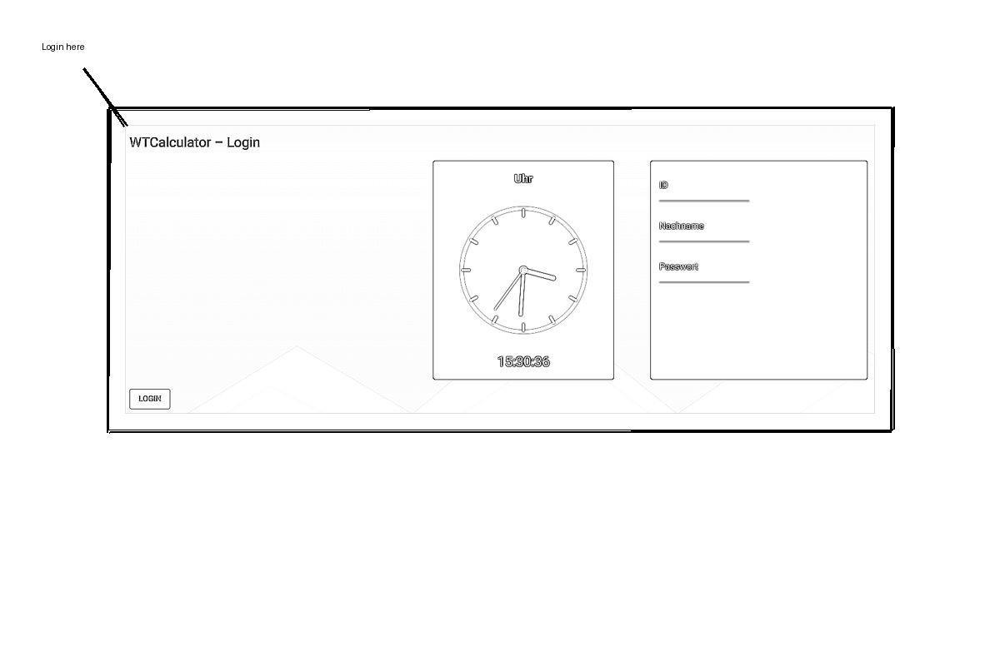
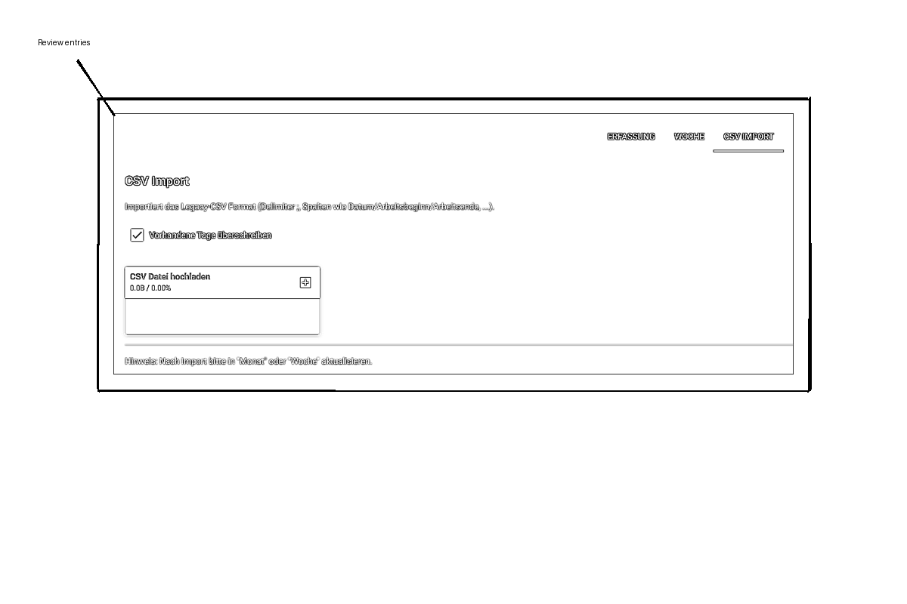
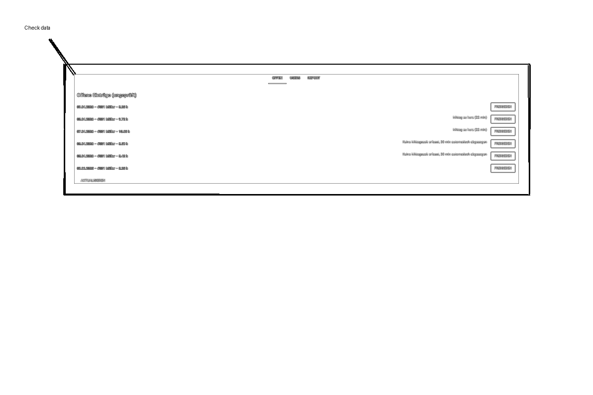
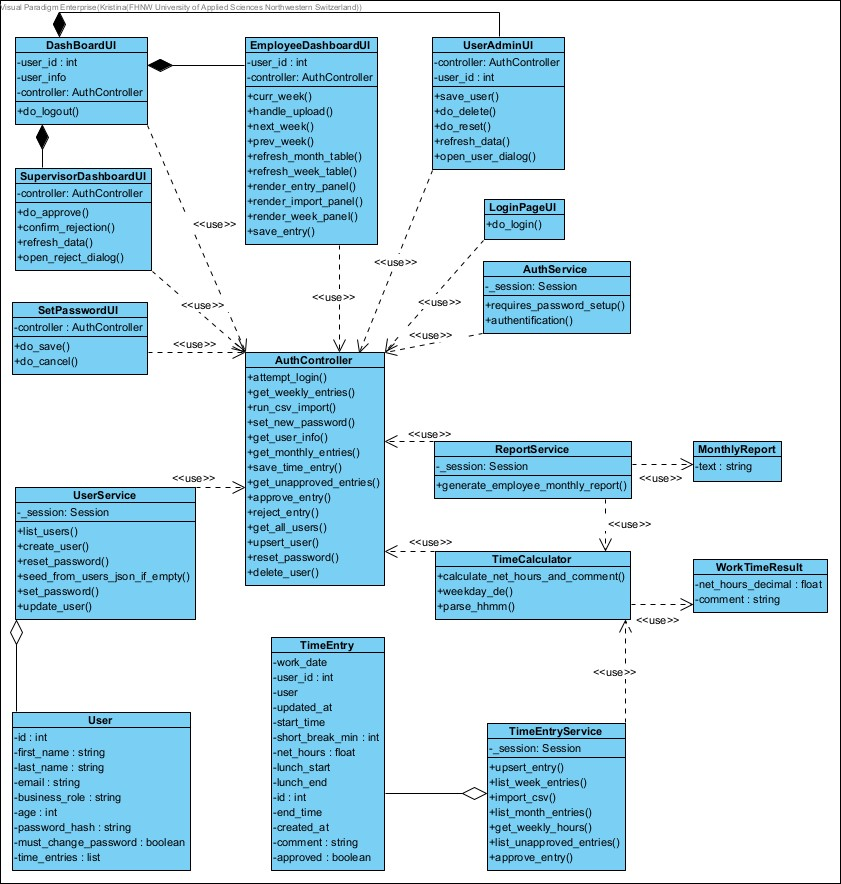
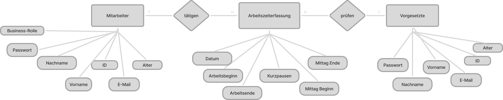
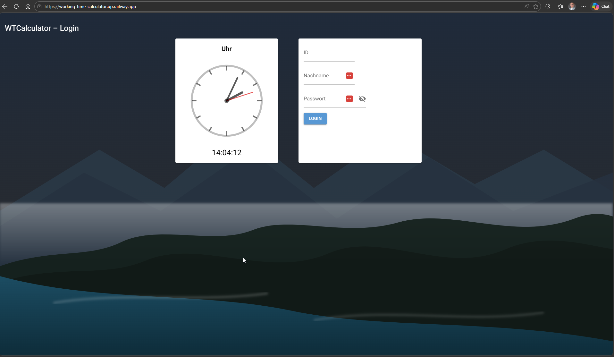
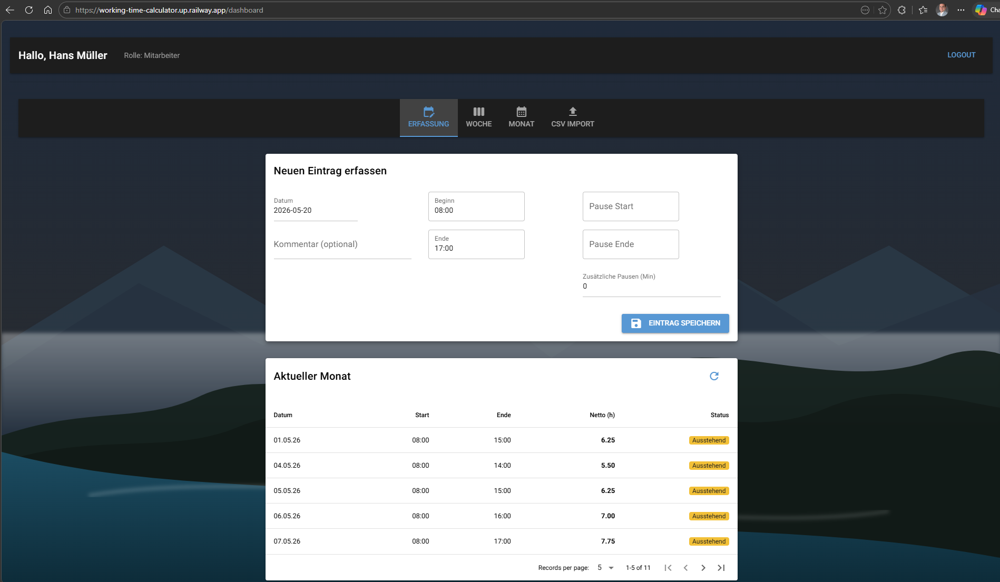
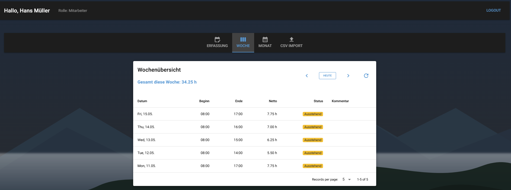
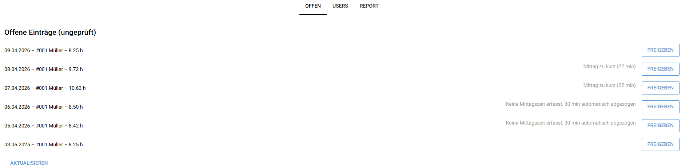

# 📊🔢 WTCalculator – Working Time Calculator (Browser App)

> 
## 📝 Application Requirements

### Problem
> Für kleinere Firmen ist das Erfassen der Arbeitszeiten ein essentieller Prozess.  
Kommerzielle Lösungen wie SAP sind jedoch teuer. Mit unserer App bieten wir eine **einfache und kostengünstige Alternative** zur Arbeitszeiterfassung.

### Scenario
In unserer Python Appikation sollen Arbeitszeiten erfasst und ausgewertet werden können. Ein User kann Arbeitsbeginn und Arbeitsende als Uhrzeiten erfassen und die Pausen als Stunden/Minuten Input. Ausgewertet wird die Brutto und die Netto Arbeitszeit. 
Die ausgerechneten Zeiten werden mit bestimmten Rules, die festgelegt sind, abgeglichen. Beispiele sind hier: Maximalarbeitszeiten (Max Überstundenanzahl), Einhaltung der Mittags-Pausenzeit (Keine Pausen unter 30 Minuten).
Der Vorgesetzte kann die Mitarbeiter-Daten pflegen (wie bspw. das Alter), damit die gültigen Regeln (z.B. Jugendschutzgesetz) automatisch angewendet werden.

## 📖 User Stories
1. Als User möchte ich meine Arbeitszeit exakt eingeben (hh:mm) 
2. Ich möchte meine Tages-, Wochen- und Monatsarbeitszeit sehen (Eingabe einzelner Tage und Auswertung der Woche oder des Monats mit bestehenden Daten) 
3. Als User möchte ich eine Fehlermeldung in Form eines Kommentars sehen, wenn ich die gesetzliche mindest Mittagszeit unterschreite
4. Ich möchte als User Mittagspausen eintragen können.
5. Ich möchte als User eine Warnmeldung als Kommentar bekommen, wenn meine maximale Wochenarbeitszeit 45h überschritten ist 
6. Ich möchte mich als User bei der Verwendung des Tools mittels ID, Nachname und Passwort authentifizieren 
7. Als Vorgesetzter will ich Ende des Monats oder der Woche einen Repport erstellen können über die Arbeitszeiten meiner Mitarbeiter 
8. Als minderjähriger Mitarbeiter darf ich nicht über 9h arbeiten und keine Nacht- oder Wochenendarbeit machen, damit die Jugendarbeitsschutzgesetze eingehalten werden. Ausnahmen können begründet vorkommen oder es können nachträglich die Zeiten korrigiert werden

## 🧩 Use Cases
- Authentifizieren mittels ID, Nachnahmen und Kennwort
- Arbeitszeiten und Mittagspausen eingeben  
- Eingaben validieren  
- Zeitrapport auf Wochen- und Monatsbasis ausgeben  
- Kommentare bei Regelverletzungen anzeigen
- Unterschiedliche Menüs für Mitarbeiter und Vorgesetzte


### Main Use Cases
- Zeit erfassen (Mitarbeiter)  
- Zeiterfassung überprüfen (Vorgesetzter)  

-> im Diagramm wird nur die UC-Gruppe der Zeiterfassung beschrieben:



### Actors
- Mitarbeiter  
- Vorgesetzter

---

### Wireframes / Mockups

#### Mockup: Login


#### Mockup: CSV Import


#### Mockup: Superior View



---

## 🏛️ Architecture


---
### Layers
---
#### UI: NiceGUI
Die Benutzeroberfläche wird mit NiceGUI umgesetzt. Sie dient zur Eingabe und Anzeige von Benutzerdaten, Zeiteinträgen und Auswertungen.

#### Application logic: Services und TimeCalculator
Die Geschäftslogik liegt in den Service-Klassen. AuthService verwaltet die Anmeldung, UserService die Benutzer, TimeEntryService die Zeiteinträge und ReportService die Monatsauswertungen. Der TimeCalculator berechnet die Nettoarbeitszeit und erzeugt Kommentare.

#### Persistence: SQLite, ORM und Datenmodelle
Die Daten werden über ORM-Modelle gespeichert. User und TimeEntry bilden die zentralen Datenobjekte. Ein Benutzer kann mehrere Zeiteinträge besitzen, während jeder Zeiteintrag genau einem Benutzer gehört. 

---
### Design Decisions
---

#### Cleat separation between data and logic
User, TimeEntry, MonthlyReport und WorkTimeResult enthalten Daten. Die Services übernehmen die Verarbeitung und greifen auf diese Klassen zu.

#### Service oriented structure
Jede Service-Klasse hat eine klar abgegrenzte Aufgabe: Authentifizierung, Benutzerverwaltung, Zeiterfassung oder Reporting.

#### Calculation logic outsourced
Die Berechnung der Arbeitszeit ist im TimeCalculator gekapselt. Dadurch bleibt TimeEntryService übersichtlich und delegiert die Berechnung an eine eigene Klasse.

---
### Patterns Used
---

#### Service Pattern
AuthService, UserService, TimeEntryService und ReportService kapseln die Anwendungslogik.

#### Repository / DAO approach via session
Alle Services verwenden eine _session, um Daten zu lesen, zu speichern oder zu verwalten. Dadurch ist der Datenzugriff von der restlichen Logik getrennt.

#### Model Relationship
User und TimeEntry stehen in einer 1:n-Beziehung. Ein Benutzer kann viele Zeiteinträge haben, ein Zeiteintrag gehört zu genau einem Benutzer.

#### DTO / Result Objects
MonthlyReport und WorkTimeResult dienen als einfache Rückgabeobjekte für Reports und Berechnungsergebnisse.

---

## 🗄️ Database and ORM



Die Anwendung nutzt ***SQLAlchemy***, um Domänenobjekte einer SQLite-Datenbank zuzuordnen.

### Entities
- `Mitarbeiter`
- `Vorgesetzte`
- `Arbeitszeiterfassung`

### Relationships
- Ein `Mitarbeiter` → mehrere `Arbeitszeiterfassung`
- Jede `Arbeitszeiterfassung` wird geprüft durch ein `Vorgesetzte`

---

## ✅ Project Requirements

---

Jede Applikation muss die folgenden Kriterien erfüllen, um akzeptiert zu werden (siehe auch die offiziellen Projektvorgaben auf Moodle):

1. Verwendung von NiceGUI für die Entwicklung einer interaktiven Webapplikation
2. Datenvalidierung innerhalb der Anwendung
3. Verwendung eines ORM für das Datenbankmanagement

---

### 1. Browser-based Application (NiceGUI)


Die Applikation interagiert mit dem Benutzer über den Browser. Benutzer können:

- Sich einloggen
- Ihre Arbeitszeiten erfassen
- Kommentare und Hinweise erhalten, wenn Arbeitszeiten gegen Validierungsregeln verstossen
- Arbeitszeitrapporte generieren (z. B. für Vorgesetzte)

**Architektur-Hinweis (gemäss SS26-Richtlinien):**  
Der Browser fungiert als Thin Client. Die Darstellung der Benutzeroberfläche erfolgt clientseitig, während der Applikationszustand sowie die Businesslogik serverseitig innerhalb der NiceGUI-Applikation verarbeitet werden.

Das Projekt verwendet objektorientierte Programmierung in Python, um die Businesslogik in modulare und wiederverwendbare Komponenten zu strukturieren.


---

### 2. Data Validation

- **Benutzervalidierung:**  
  Der Benutzer gibt seine Mitarbeiter-ID und seinen Nachnamen ein. Der Check-In prüft, ob beide Eingaben mit den Mitarbeiterdaten aus dem JSON-Dictionary übereinstimmen. Die ID darf nur aus Zahlen bestehen.

- **Altersvalidierung:**  
  Ist ein Benutzer minderjährig, werden Warnungen ausgegeben bei:
  - mehr als 9 Stunden Arbeitszeit pro Tag
  - Nachtarbeit zwischen 22:00 und 06:00 Uhr
  - Wochenendarbeit

- **Zeitformat-Validierung:**  
  Arbeitszeiten dürfen nur im Format `hh:mm` eingegeben werden.

- **Pausenvalidierung:**  
  Der Benutzer gibt seine Mittagszeiten ein. Wird keine Mittagspause erfasst, wird automatisch die gesetzliche Mindestpause von 30 Minuten abgezogen, ausser es wird Nachtarbeit erkannt oder weniger als 6 Stunden Arbeitszeit erfasst.

- **Arbeitszeitvalidierung:**  
  Die vorgesehene Arbeitszeit beträgt 45 Stunden pro Woche. Alles darüber wird als Überzeit behandelt. Überzeiten über 45 Stunden sind nicht vorgesehen, jedoch nicht verboten.

- **Eingabevalidierung:**  
  Diverse Eingaben im Check-In und Menü werden auf das korrekte Format geprüft, bei Bedarf korrigiert (z. B. Gross-/Kleinschreibung) oder mit einer Fehlermeldung kommentiert und zur erneuten Eingabe aufgefordert.

---

### 3. Database management

- Für das ORM wird SQLAlchemy verwendet.
- Python-Objekte werden innerhalb von Datenbank-Sessions erstellt und verwaltet.
- Datenbankabfragen werden mit ORM-Syntax anstelle von direkten SQL-Befehlen umgesetzt.
- Daten werden über Klassenattribute und Modellbeziehungen gefiltert und ausgelesen.
- Objektattribute wie `xy.approved` werden verwendet, um automatische Updates innerhalb der Services auszulösen.

---

## ⚙️ Implementation

### Technology
- Python 3.x
- Umgebung: GitHub Codespaces
- Benötigte externe Bibliotheken: SQLAlchemy, NiceGUI

### Libraries Used

### External Libraries (Third-Party)

* **[SQLAlchemy](https://www.sqlalchemy.org/):** Wir nutzen es als Object-Relational Mapper (ORM), um objektorientiert mit der SQLite-Datenbank zu interagieren.
* **[NiceGUI](https://nicegui.io/):** Unser Frontend-Framework. Es ermöglicht uns, die gesamte grafische Web-Benutzeroberfläche (Dashboards, Tabellen, Dialoge) direkt und nahtlos in Python zu entwickeln.
* ** `pytest / pytest-cov`: Unser Framework für das automatisierte Unit-Testing und zur Messung der Testabdeckung (Coverage), um die Code-Qualität sicherzustellen.

### Python Standard Libraries (Built-ins)

* **`datetime` / `date, time, timedelta`:** Für Logik der Arbeitszeitberechnung, Pausenabzüge, Nachtschichterkennung sowie die dynamische Altersberechnung anhand des Geburtsdatums.
* **`dataclasses`:** Für schlanke und unveränderliche Datenobjekte (z. B. `WorkTimeResult`, `MonthlyReport`) zur sicheren Datenübergabe zwischen den Schichten.
* **`unittest.mock (patch)`: Wird im Testing verwendet, um externe Abhängigkeiten (wie Datenbank-Sessions) durch kontrollierte Test-Objekte ("Mocks") zu ersetzen, was isolierte Unit-Tests ermöglicht.
* **`contextlib (contextmanager)`: Wir bauen eigene, temporäre Kontexte (wie gemockten session_scope in den Tests) auf und wieder ab.
* **`csv` / `io`:** Für den reibungslosen Import und die Verarbeitung der alten (Legacy) Zeiterfassungsdaten.
* **`json`:** Für das automatische Seeding (initiale Befüllung) der Datenbank mit Benutzerdaten.
* **`pathlib`:** Für moderne, sichere und betriebssystemunabhängige Pfad- und Dateioperationen.

### 📂 Repository Structure

Das Projekt folgt einer sauberen MVC-Architektur (Model-View-Controller) mit einer dedizierten Service- und Domain-Schicht.

```text
WORKING-TIME-CALCULATOR/
├── .devcontainer/         # Konfiguration für Entwicklungscontainer (z.B. GitHub Codespaces)
├── .dockerignore          # Docker-spezifische Ausschlüsse
├── .nicegui/              # Lokale NiceGUI-Arbeitsdaten
├── .vscode/               # Lokale Editor-Einstellungen für VS Code
├── data/                  # Speicherort für lokale Daten (z.B. die SQLite-Datenbank)
├── scripts/               # Hilfs- und Setup-Skripte
├── .venv/                 # Lokale Python-Umgebung
├── wtcalculator/          # 📦 Hauptpaket der Anwendung
│   ├── docs/ui-images/    # Bilder für Dokumentation, Mockups und UML-Diagramme
│   ├── domain/            # Kern-Geschäftslogik
│   │   └── time_calculator.py # Reine Berechnungslogik (z.B. Nettoarbeitszeit, Pausenabzug)
│   ├── services/          # Service-Schicht (Datenbank-Interaktion & Validierung)
│   │   ├── auth_service.py
│   │   ├── report_service.py
│   │   ├── time_entry_service.py
│   │   └── user_service.py
│   ├── app_controler.py   # Zentraler Controller (verbindet UI mit Services)
│   ├── db.py              # Datenbank-Verbindung und Session-Management (SQLAlchemy)
│   ├── models.py          # SQLAlchemy ORM-Modelle (Tabellenstrukturen für User & Zeiten)
│   ├── security.py        # Sicherheitsfunktionen (Passwort-Hashing & Policies)
│   └── webapp.py          # Präsentationsschicht (NiceGUI Views & UI-Klassen)
├── .gitignore             # Ignorierte Dateien für die Versionskontrolle
├── main2.py               # Bootstrapper/Einstiegspunkt der Anwendung
├── README.md              # Hauptdokumentation des Projekts
└── requirements.txt       # Python-Abhängigkeiten und Bibliotheken
```
### How to Run 

### 1. Launch
https://working-time-calculator.up.railway.app/

Öffne die URL in deinem Browser

### 2. Login

### Authetification as Employee
#### Benutzerübersicht
 | ID  | Nachname      | Rolle       |
 | --- | ------------- | ----------- |
 | 001 | Müller        | Mitarbeiter |
 | 002 | Suter         | Mitarbeiter |
 | 003 | Hübner		(u18) | Mitarbeiter |
 | 004 | Ackermann     | Vorgesetzer |

Erfasse Arbeitszeit, lade eine .csv-Datei hoch oder schau dir deine erfassten Arbeitszeiten der Wochen / Monate an

### Possibilities as Superior:
1. Mutiere Mitarbeiter-Daten
2. Prüfe Arbeitszeit der Mitarbeitenden und gebe diese frei
3. Erstelle Rapporte als PDF
--- 

## Screenshots of Webapp:

### Startpage


### Startpage after employee login


### Week-overview employee


### Superior View after Login


---

## 🧪 Testing

### Running Tests

```bash
# Install pytest (if not already installed)
pip install pytest
pip install pytest-cov

# Run all tests
pytest tests/ -v

# Run with coverage
pytest tests/ --cov=wtcalculator
```

### Test Structure

```
tests/
├── conftest.py                 # Pytest fixtures (test database, sample users)
├── test_time_calculator.py     # Domain logic tests (net hours, minor rules, overtime)
├── test_time_entry_service.py  # Service layer tests (CRUD, weekly/monthly hours)
├── test_app_controler.py      # Controller tests (validation, parsing)
└── test_ui_employee_dashboard.py  # UI import tests, constants validation
```

### Test Coverage

- **Unit tests**: Time calculation logic, date/time parsing, user validation
- **Service tests**: TimeEntry CRUD, weekly/monthly hour calculations, approvals
- **Controller tests**: Input validation, error handling
- **Constants tests**: Verification of rule constants (45h weekly max, 30min break min, etc.)

**Current test count**: 39 passing, 4 skipped (UI imports skipped due to NiceGUI Python 3.14 compatibility)

---

## 👥 Team & Contributions

| Name               | Contribution                                                                                                                                                                                                                              |
| ------------------ | ----------------------------------------------------------------------------------------------------------------------------------------------------------------------------------------------------------------------------------------- |
| Flavio Waser       | NiceGUI UI, Uhr auf Login Seite, Anpassung des Hauptcodes auf objektorientierte Programmierung, Mockups, CSV-Import                                                                 |
| Kristina Schaffner | NiceGUI UI, Readme-File und diverese Grafiken, Passwort-Design optimieren, Umbau des ersten Entwurfs nach MVC                                                                        |
| Mika Leuenberger   | NiceGUI UI, Programmstart, diverse Validierungen überprüfen und aktualisieren, PDF Generierung |


## 🤝 Contributing

> 🚧 This is a template repository for student projects.  
> 🚧 Do not change this section in your final submission.

- Use this repository as a starting point by importing it into your own GitHub account.  
- Work only within your own copy — do not push to the original template.  
- Commit regularly to track your progress.

## 📝 License

This project is provided for **educational use only** as part of the Programming Foundations module.  
[MIT License](LICENSE)
